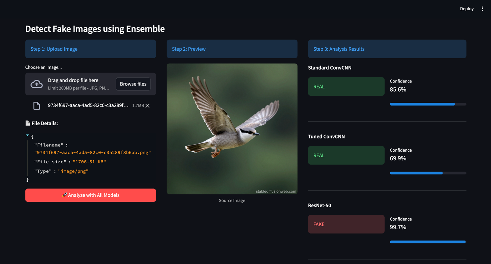
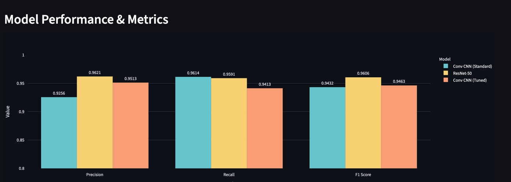
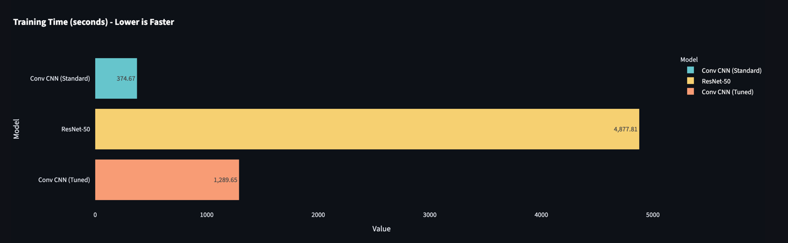

# FDL_AI-Generated_Images_Recognizer_Project
Project for FDL subject in PJAIT

This project implements a Machine Learning pipeline to detect whether an image is real or AI-generated. It features Backend API serving multiple trained models (two CNN-based models and ResNet-50 model) and Frontend dashboard for interactive image analysis and prediction

## Table of Contents
- [Project Overview](#project-overview)
- [Project Demonstration](#project-demonstration)
- [Dataset](#dataset)
- [Usage](#usage)
- [Model Results](#model-results)
  - [Benchmarks](#benchmarks)
  - [Baseline CNN Results](#baseline-cnn-results)
  - [Tuned CNN Results](#tuned-cnn-results)
  - [ResNet-50 Results](#resnet-50-results)

---

## Project Overview

The goal of this application is to classify images as "REAL" or "FAKE"

**Key Features:**
- **Multiple Models:** Comparison between Baseline CNN, Hyperparameter Tuned CNN, ResNet-50 models
- **Backend:** FastAPI service that loads pre-trained models and handles inference requests
- **Frontend:** Streamlit application allowing users to upload images and view classification confidence across models
- **Analysis:** Visualizations of training metrics and model efficiency

---

## Project Demonstration

Here is how the application looks and functions:

### 1. Interactive Detection Dashboard
User can upload image to analyze it using the ensemble of models. The system displays the prediction (Real/Fake) and confidence level for each model



### 2. Training Metrics
A dedicated tab displays the comparative performance (Precision, Recall, F1-Score) and training time efficiency of the models.




---

## Dataset
The models were trained using the **CIFAKE Dataset** (Real vs. AI-Generated Synthetic Images):
[Link to CIFAKE Dataset](https://www.kaggle.com/datasets/birdy654/cifake-real-and-ai-generated-synthetic-images)

---

### Usage
- Python 3.10+

### 1. Download libraries
```bash
pip install -r requirements.txt 
```

### 2. Run the Backend
```bash
uvicorn backend.main:app -reload
```

The API will be available at `http://127.0.0.1:8000`.

### 3. Run the Frontend

```bash
streamlit run frontend/app.py
```

The interface will open in your browser at `http://localhost:8501`.

---

## Model Results

We evaluated three different architectures. Below are the visual benchmarks and detailed statistics.

### Benchmarks

**Important Observation:**
Although the Baseline CNN and Tuned CNN have close evaluation metrics, in practice **ResNet-50 recognizes AI-generated images better** and proves to be more robust in real-world scenarios.

### Baseline CNN Results


```
============================================================
                        TEST RESULTS                        
============================================================
- Precision:    0.9256
- Recall:       0.9614
- F1 Score:     0.9432
- Training Time: ~375s
```

### Tuned CNN Results


```
============================================================
                        TEST RESULTS                        
============================================================
- Precision:    0.9513
- Recall:       0.9413
- F1 Score:     0.9463
- Training Time: ~1290s
```

### ResNet-50 Results


```
============================================================
                        TEST RESULTS                        
============================================================
- Precision:    0.9621
- Recall:       0.9591
- F1 Score:     0.9606
- Training Time: ~4878s
```